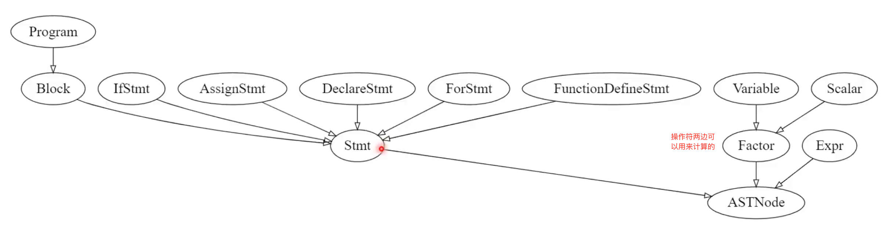
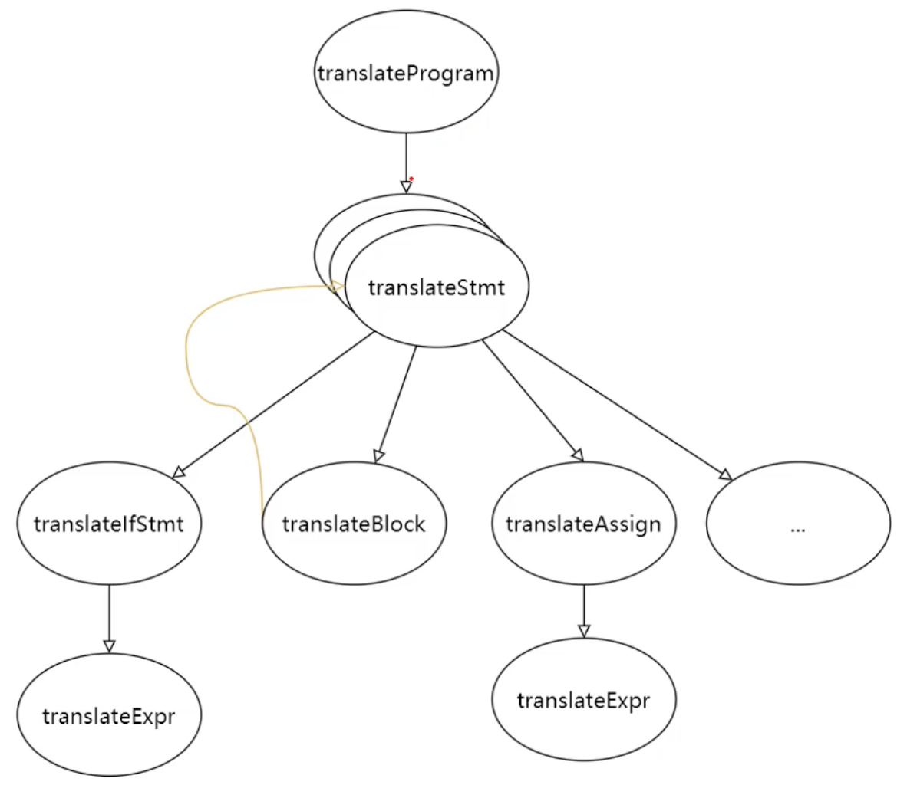
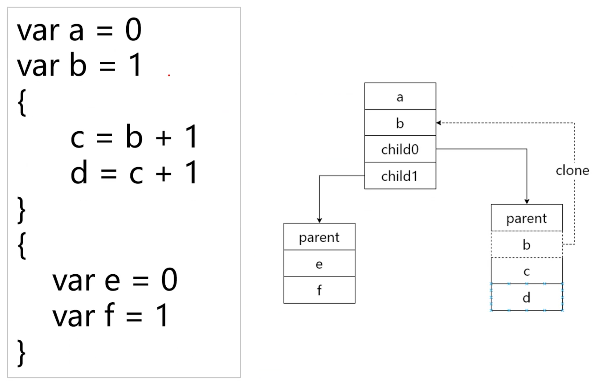
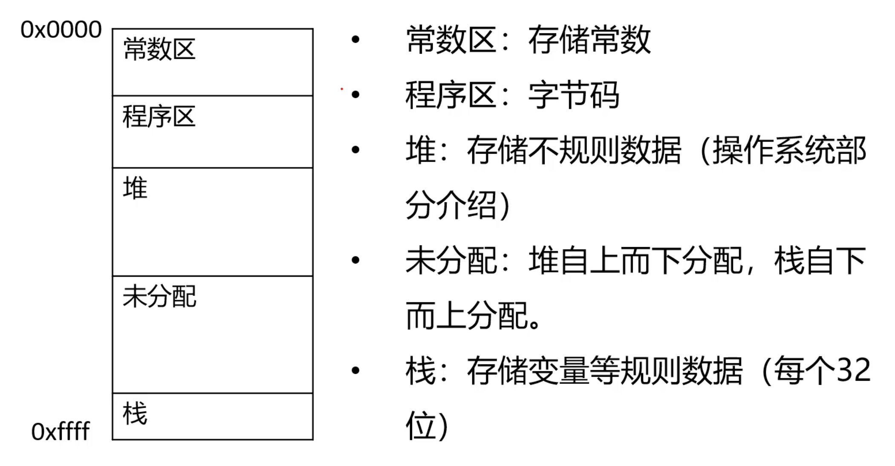

# TinyScript Go Version

---

[慕课网：程序员三大浪漫--编译原理+操作系统+图形学](https://coding.imooc.com/class/432.html) 编译原理部分 Golang 版本

---

## 笔记

### AST structure



---

### 右递归

```text
A -> β A'
A' -> α A' | ε
```

例一 Expr -> Expr + 1 | 1 转换成右递归

```text
Expr -> 1 Expr'
Expr' -> +1 Expr' | ε
```

例二 A -> A α | A β | A γ | λ

λ[αβγ]\*

```text
A -> λ A'
A' -> α A' | β A' | γ A' | ε
```

例三 E -> E + E | E - E | d; d -> 0|1|2|3|4|5|6|7|8|9

```text
E -> d E'
E' -> +E E' | -E E' | ε
```

---

### 优先级控制

加减乘除控制

Expr -> Expr + Term | Expr - Term | Term

Term -> Term * Factor | Term / Factor | Factor

Factor -> [0-9]+

去左递归

Expr -> Term Expr_

Expr_ -> + Term Expr_ | - Term Expr_ | ε

Term -> Factor Term_

Term_ -> * Factor Term_ | / Factor Term_ | ε

Factor -> [0-9]+

---

### 领域模型架构

技术细节 --> 领域模型 --> 业务

- 技术细节 (编译器使用何种语言实现？应该使用怎样的数据结构？)
- 领域模型 (词法分析(符号) **-->** 语法分析(抽象语法树)) 需要抽象的思维
- 业务 (TinyScript)

---

### 三地址代码

一行最多有三个地址的代码

```text
var x = 5 * 3 + 2 * 4
```

```text
p0 = 5 * 3
p1 = 2 * 4
x = p0 * p1
```

等价递归求解

```text
func eval(expr) {
    if (expr is Factor) {
        return expr.Value
    }
    return eval(expr.Left) expr.op eval(expr.Right)
}
```

更多的关于 if、for、function 的需要使用到 label、goto 以及其他的一些特殊语句

---

### 三地址代码指令

- TAProgram
    - TAInstruction
        - type
        - result
        - operator
        - arg1
        - arg2
    - TAInstruction
        - ....
    - ...



---

### 基于 SDD 的翻译

Syntax Directed Definition：定义抽象语法树如何被翻译

组成：文法（如何组织翻译程序）
- 属性：用于存储结果和中间值
- 规则：描述属性如何被计算

抽象语法树 --> 应用...的语法制导规则 --> 其他代码

---

### 词法作用域和符号表

词法作用域（Lexical Scope）：一个符号的可见范围

符号表：用于存储符号(变量、常量、标签)在源代码中的**位置、数据类型**，以及位置信息决定的**词法作用域**和运行时的**相对内存地址**。
- 静态符号表：存储常量，使用 哈希表 实现
- 符号表：存储每个符号所在的词法作用域以及其在其中的相对位置，使用 树+哈希表 实现

符号 Symbol
- 常量 Immediate Symbol
- 变量 Address Symbol
- 标签 Label Symbol



---

### 运行时的内存分布



---

## 参考

[elvin-du/tinyscript](https://github.com/elvin-du/tinyscript)
